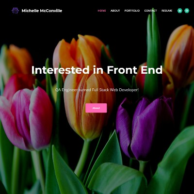
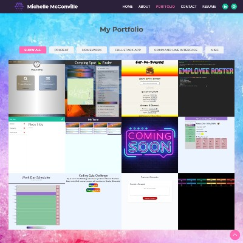

# [16-updated-portfolio](https://github.com/MichelleMcConville/16-updated-portfolio) 🔗


## Description

Updated my portfolio to a more modern layout!

## Screenshots

| ***Home***                     | ***Portfolio***                         |
| :----------------------------: | :-------------------------------------: |
|  |  |

## Table of Contents ✨

* [Installation](#installation)
* [Usage](#usage)
* [Contributing](#contributing)
* [Tests](#tests)
* [Questions](#questions)
* [License](#license)

## Installation 🛠️ <a name="installation"></a>

```.
Just a Website. No installation required.
```

## Usage ⚙️ <a name="usage"></a>

```.
Select the link below & enjoy!
```

> [My Updated Portfolio](https://michellemcconville.github.io/16-updated-portfolio/) 🔗

## Contributing 🤝 <a name="contributing"></a>

All contributions must be approved by owner

## Tests ✅ <a name="tests"></a>

There are currently no testing procedures for this application

## Questions ❓ <a name="questions"></a>

* 📧 If you have any questions please [**eMail**](mailto:dev.mchel@gmail.com) me
* :octocat: Check out more of my work on [**GitHub**](https://github.com/MichelleMcConville)

## License 📝 <a name="license"></a>

This project is **`Creative Commons`** licensed

---

 Copyright ©️ 2021 🌷 Michelle McConville
